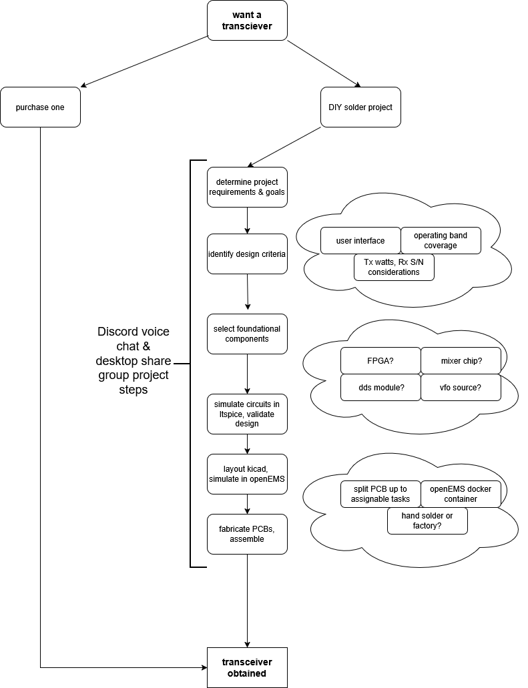

# make a radio project
describe a goal centered on a task or a component, organize people interested in the design and or build process

 
 
 

## 1) AD9854 TX ONLY SDR
- using AD9854ASTZ DDS to generate SSB/AM/FM from 1 to 30mhz
- want to pair to RP2350 / PI PICO 2 for simplicity
- class-A amplifier to make output useable
- build it as a hobby learning tool
optionally : add on AD9200 10-bit ADC for rx support (lots of extra work)

## 2) Class-E 2200M 137KHZ oscillator
- simple N-mosfet class E transmitter to experiment with
  (files not uploaded yet)

 
 
 

## general process of turning an idea into a board

